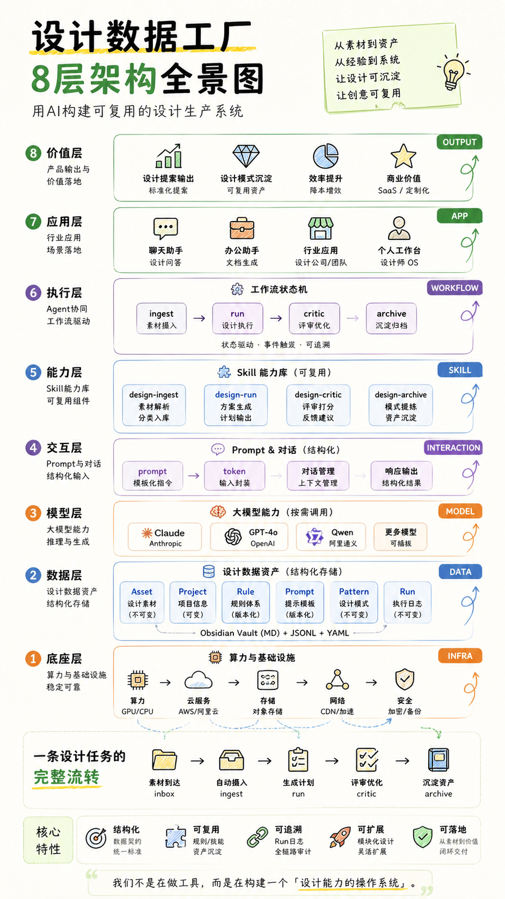

# AI Native Design Harness Runtime

Design Data Factory v6 is now evolving into an **AI Native Design Harness Runtime**: a deterministic runtime layer for design agents, review loops, design memory, and reusable design infrastructure.

This repository now has three connected identities:

- **AI Native Design Harness Runtime**: an execution harness for AI-assisted design workflows.
- **Design Agent Runtime**: a task lifecycle for planner, generator, critic, review, retry, and archive stages.
- **Design Infrastructure OS**: a structured operating layer for design assets, prompts, rules, critiques, patterns, and run history.

The original Design Data Factory remains the data and pipeline foundation. The Harness adds runtime behavior on top of it.

## Harness Runtime Architecture

```text
Goal
  |
  v
Runtime
  |
  v
Planner
  |
  v
Generator
  |
  v
Critic
  |
  v
Retry Loop <---- critic feedback
  |
  v
Archive
  |
  v
Pattern
```

The current Harness runtime is intentionally deterministic. It does not need a live LLM to prove lifecycle behavior, state transitions, event logging, review gates, or retry semantics.

## 移动端飞书文档入口

Use Feishu as the mobile workspace for Codex and Harness reports, usage guides, and project summaries:

- [AI Native Design Runtime 使用指南](https://www.feishu.cn/docx/VR1udIMLwosSb5xmohZcSgr9nEc)
- [Mars 的 Codex 使用指南](https://www.feishu.cn/docx/OrlJdlCSYo7w7exV6Vwc4HCAn7c)
- [AI Native Design Runtime 展示测试页](https://www.feishu.cn/docx/UAy2dLx7Bo1qioxYUGRc7sEFngd)

## Demo Cockpit / 展示测试界面

Open the local single-file cockpit:

```bash
open demo/runtime_cockpit.html
```

Run the deterministic Harness demo:

```bash
python3 scripts/run_harness_demo.py examples/harness_goal.yaml
```

Feishu display document:

- [AI Native Design Runtime 展示测试页](https://www.feishu.cn/docx/UAy2dLx7Bo1qioxYUGRc7sEFngd)

## Git Workflow / Runtime Governance

Git workflow guide:

- Local guide: [Git Commit vs Git Push：AI Runtime 日常工作流指南](docs/feishu/GIT_WORKFLOW_GUIDE.md)
- Feishu guide: pending publish; `lark-cli docs +create` is blocked by missing local app secret keychain entry even though `tokenStatus=valid`.

Principles:

- `git commit` records local Runtime milestones.
- `git push` publishes those milestones to GitHub.
- Review before push, especially for tokens, output, logs, pycache, docs, auth cache, workspace metadata, and local paths.

## Current Harness Capabilities

- **Lifecycle**: runs a task through planner, generator, critic, review, archive.
- **Event log**: records runtime events such as step starts, step finishes, critic pass/fail, retry, review, and run finish.
- **Review loop**: requests review before archive and can stop with `REVIEW_REQUIRED`.
- **Retry**: sends critic feedback back to the generator when critic fails.
- **Archive**: promotes a passing mock visual into a mock archive pattern.
- **Deterministic runtime**: supports repeatable local execution and tests without real LLM calls.

## CLI Usage

Run the Harness demo:

```bash
python3 scripts/run_harness_demo.py examples/harness_goal.yaml
```

The demo prints `run_id`, `review_required`, `retry_count`, `max_retries`, `final_state`, `step_history`, and `event_log`.

## Current Stage

- **M1 Skeleton**: task specs, registry, runtime shell, review decision model.
- **M2 Runtime Execution**: deterministic planner, generator, critic, review, archive lifecycle.
- **M3 Review/Retry Loop**: critic feedback loop, retry count, max retries, pass/fail events, final state.

## Next Stage

- **M4 Memory**: feed archived patterns and runtime history back into future planning.
- **M5 Evaluator**: add repeatable evaluation cases and quality gates for design outputs.
- **M6 Multi-Agent Runtime**: coordinate multiple specialized design agents under one runtime.

## Why Harness Matters More Than One-Off Image Generation

Single-shot image generation produces an artifact. A Harness produces an operating loop.

For serious design work, the important system is not only the model call. It is the lifecycle around the model: what goal was given, what plan was made, what was generated, how it was judged, what feedback was applied, what was retried, what was archived, and what can be reused later.

The Harness turns AI design from isolated outputs into inspectable infrastructure. That makes design work testable, repeatable, reviewable, and compounding.

# Design Data Factory v6

Design Data Factory is an AI-powered design production system that turns design work into reusable, structured data assets.

It models a complete loop:

```text
ingest -> run -> critic -> archive -> pattern reuse
                -> generate -> critic-visual -> archive
```

Instead of treating design as static files, this repository treats assets, prompts, rules, plans, critiques, runs, and patterns as versioned knowledge that can be inspected, tested, and reused.

## Product Architecture



## Why This Exists

Design teams repeatedly solve similar problems: collect source material, interpret a brief, generate directions, review quality, preserve what worked, and reuse it later. Design Data Factory makes that loop explicit and operable by agents.

The result is a small but complete foundation for a "Design OS":

- structured design data stored as Markdown frontmatter, JSONL, and YAML;
- deterministic dry-run execution for local testing;
- prompt, rule, and schema entities that can evolve independently;
- pattern recommendation so past work influences future runs;
- audit-friendly run logs for every major step.

## Core Workflow

| Stage | Script | Output | Purpose |
|---|---|---|---|
| Ingest | `scripts/scan_inbox.py` | `manifest.jsonl`, asset notes, run log | Structure raw design files into Asset entities |
| Run | `scripts/run_design.py` | Plan Markdown, Plan JSONL, prompt snapshot, run log | Generate concept directions from project context |
| Critic | `scripts/critic_design.py` | Critique Markdown, Critique JSONL, run log | Score a direction with rubric rules |
| Archive | `scripts/archive_design.py` | Pattern Markdown, Pattern JSONL, run log | Promote a passed direction into reusable knowledge |
| Generate | `scripts/generate_design.py` | Visual Markdown/JSONL, manifest.jsonl, run log | Turn Plan directions into visual posters via Lovart or mock |

## Key Features

- **Closed-loop design memory**: archive successful directions into Patterns, then recommend those Patterns in later runs.
- **Agent-operable pipeline**: CLI scripts expose each workflow step with explicit inputs and outputs.
- **Structured entities**: Project, Asset, Prompt, Rule, Plan, Critique, Pattern, and Run records use parseable frontmatter.
- **Dry-run first**: core scripts work without live LLM calls, making the pipeline testable and safe by default.
- **LLM hook support**: `--llm hook --llm-hook <path>` allows real model calls without coupling providers into the core scripts.
- **Auditable by design**: prompt snapshots, JSONL outputs, consumed assets, consumed patterns, and run logs make decisions traceable.

## Repository Layout

```text
.
├── harness/        # AI Native Design Harness Runtime
├── examples/       # Harness demo goal files
├── scripts/        # CLI entry points: ingest, run, critic, archive
├── shared/         # loaders, schema validation, prompt rendering, engines
├── references/     # sample projects, prompts, rules, patterns, schemas, runs
├── tests/          # focused regression tests
├── docs/           # project notes and Codex operating guide
└── imports/        # historical imports and merge snapshots
```

## Quick Start

Check the repository:

```bash
git status --short --branch
python3 scripts/run_design.py --help
python3 -m pytest -q
```

Run the test suite:

```bash
python3 -m pytest -q
```

Generate a concept Plan from an existing Project and manifest:

```bash
python3 scripts/run_design.py \
  --project references/10_Projects/prj_acme_q4_campaign/project.md \
  --manifest <staging-dir>/manifest.jsonl \
  --prompts-dir references/50_Prompts \
  --out <run-output-dir> \
  --patterns-dir references/30_Patterns \
  --rules-dir references/40_Rules \
  --llm dry-run
```

Generate a Visual from a Plan direction:

```bash
python3 scripts/generate_design.py \
  --plan <run-output-dir>/<plan-id>.md \
  --direction dir_001 \
  --out <generate-output-dir> \
  --llm dry-run
```

Or generate from a manual prompt (no Plan needed):

```bash
python3 scripts/generate_design.py \
  --prompt "暗调留白风格，高端餐饮海报" \
  --manifest <staging-dir>/manifest.jsonl \
  --asset-ids ast_abc123 \
  --out <generate-output-dir> \
  --llm dry-run
```

Review a generated direction:

```bash
python3 scripts/critic_design.py \
  --plan <run-output-dir>/<plan-id>.md \
  --project references/10_Projects/prj_acme_q4_campaign/project.md \
  --direction dir_001 \
  --rules-dir references/40_Rules \
  --prompts-dir references/50_Prompts \
  --out <critic-output-dir> \
  --llm dry-run
```

## Data Model

The pipeline is built around durable entities:

- `Project`: project brief, deliverables, overrides, and run history.
- `Asset`: classified source material with hash, category, family role, and evidence.
- `Prompt`: structured instruction template with declared inputs and output schema.
- `Rule`: classification, recommendation, or rubric logic.
- `Plan`: generated concept directions and next actions.
- `Critique`: weighted score, decision, strengths, weaknesses, and feedback.
- `Pattern`: reusable design knowledge extracted from accepted work.
- `Visual`: generated image/poster entity with provenance, hash, and style metadata.
- `Run`: audit record for a pipeline execution.

## LLM Integration

The safe default is `--llm dry-run`. For real model calls, use hook mode:

```bash
python3 scripts/run_design.py \
  --project references/10_Projects/prj_acme_q4_campaign/project.md \
  --manifest <staging-dir>/manifest.jsonl \
  --prompts-dir references/50_Prompts \
  --out <run-output-dir> \
  --patterns-dir references/30_Patterns \
  --rules-dir references/40_Rules \
  --llm hook \
  --llm-hook ./scripts/<your_llm_hook>
```

The hook receives rendered prompt JSON on stdin and must write model output JSON to stdout. Keep API keys out of the repository.

## Documentation

- [Architecture Overview](docs/ARCHITECTURE_OVERVIEW.md): plain-language Harness runtime architecture.
- [Roadmap](docs/ROADMAP.md): completed milestones and next runtime evolution.
- [Harness Usage](docs/HARNESS_USAGE.md): CLI demo, retry flow, event log, and final states.
- [Harness M3 Review Loop](docs/HARNESS_M3_REVIEW_LOOP.md): M3 review/retry behavior.
- [Codex 操作指南](docs/CODEX_GUIDE.md): how to use Codex safely in this repository.
- [v6 Change Notes](docs/CHANGES.md): current v6 behavior and architecture decisions.
- [v6 Diff Report](docs/v6_diff_report.md): merge comparison report.
- [Design Skill Foundation Research](docs/design-skill-foundation-research.md): background research notes.

## Development Notes

- This repository currently has no root `requirements.txt`, `pyproject.toml`, or Makefile.
- `pytest` is used directly for tests.
- PyYAML is required by the frontmatter loader.
- Keep generated or experimental outputs in staging directories unless they are intentionally promoted into `references/`.
- Do not commit secrets, live API keys, or private client assets.

## Vision

Build the Design OS for the AI era: a system where design knowledge is structured, reusable, traceable, and continuously improved by each run.
