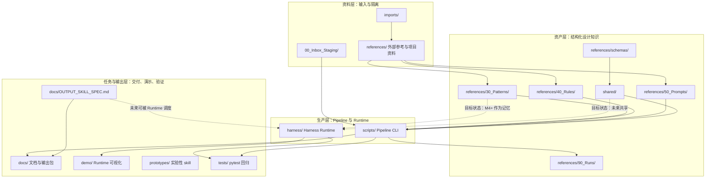

# 仓库结构总览

本文基于 `MAP.md` 和当前仓库目录整理，用于解释 AI Design Skill Lab / Design Data Factory 的结构分层、核心目录职责，以及 Design Data Factory Pipeline、Harness Runtime、Output Skill 三者之间的边界。

当前仓库不是单纯代码库，也不是素材目录。它更像一个 AI 原生设计工作流的操作系统：原始资料进入系统后，被加工成可复用的 Pattern、Prompt、Rule、运行记录、图文包、提案输出和 Runtime 能力。

## 四层结构

### 1. 资料层

资料层负责接收尚未完全消化的外部输入、历史导入和参考来源。

这一层的内容通常还不是正式资产，需要先被读取、判断、筛选和结构化。典型路径包括：

- `00_Inbox_Staging/`
- `imports/`
- `references/` 中的外部参考、项目资料、Prompt、规则和运行样本

资料层的核心原则是先隔离，再吸收。外部仓库、旧脚本、截图、文章、Prompt 候选和项目资料不应直接进入生产代码或正式输出目录，而应先作为输入或参考保存，再通过文档评估、Pipeline 处理或人工判断进入下一层。

### 2. 资产层

资产层负责保存已经被结构化、可复用、可校验的设计知识。

这一层是 Design Data Factory 的长期价值所在。它不只保存结果，也保存判断标准和复用依据。典型路径包括：

- `references/30_Patterns/`
- `references/40_Rules/`
- `references/50_Prompts/`
- `references/90_Runs/`
- `references/schemas/`
- `shared/`

其中 `references/` 更偏数据资产，保存 Pattern、Rule、Prompt、Run 和 schema；`shared/` 更偏可执行资产，提供 schema、frontmatter、prompt render、rule engine、rubric engine、recommendation engine 等共用能力。

### 3. 生产层

生产层负责把资料和资产转成可执行流程、运行时状态和可验证结果。

这一层包含两套当前独立演化的系统：

- Design Data Factory Pipeline：`scripts/` + `shared/`
- Harness Runtime：`harness/` + `scripts/run_harness_demo.py`

Pipeline 偏单步资产生产，适合盘点、生成 Plan、评价、归档和渲染；Harness Runtime 偏任务生命周期，适合用 Goal -> Plan -> Generate -> Critic -> Review -> Archive 的状态机验证一次设计任务如何被调度、评价、重试和归档。

### 4. 任务与输出层

任务与输出层负责把一次工作变成可展示、可复查、可发布或可继续迭代的交付物。

典型路径包括：

- `docs/`
- `demo/`
- `prototypes/`
- `tests/`

`docs/` 当前同时承载说明文档、评估文档、小红书图文包、Presentation 输出包和 Feishu / Obsidian 工作流说明；`demo/` 展示 Runtime 可视化原型；`prototypes/` 存放尚未转正的实验性 skill 或流程；`tests/` 保证 Pipeline 与 Harness 的关键行为可回归验证。

## 关键目录职责

### `00_Inbox_Staging/`

资料进入系统的第一站，保存尚未处理或尚未归类的捕获内容。当前可见内容包括 Obsidian / capture 流程写入的 staging note。

它属于资料层，不是长期资产库。进入这里的内容需要后续通过 `scripts/scan_inbox.py`、人工整理或其它流程转成 manifest、Asset、Plan 或参考资料。

### `imports/`

外部导入和历史迁移的原料区。当前包含 `imports/claude_20260504/` 这类导入快照，包括旧脚本、规则、run 记录和导入日志。

它的作用是保留迁移来源和吸收边界，避免历史文件直接混入当前生产代码。需要复用时，应先比较、评估，再选择性迁移到 `scripts/`、`shared/`、`references/` 或 `docs/`。

### `references/`

参考隔离区和核心设计资产库。它同时承担两类职责：

- 已沉淀资产：`30_Patterns/`、`40_Rules/`、`50_Prompts/`、`90_Runs/`、`schemas/`
- 隔离参考：外部仓库 checkout、项目资料、样本和未完全吸收的参考工程

`references/30_Patterns/` 是核心复用资产；`references/90_Runs/` 是记忆闭环关键；`references/beautiful-html-templates/` 这类外部 checkout 目前仍在隔离参考区，默认不应被当作本项目源码提交或复制。

### `scripts/`

Design Data Factory Pipeline 的 CLI 入口层。当前包含摄入、设计运行、评价、归档、生成、Harness demo 和 MAP 校验等脚本。

典型命令包括：

- `scripts/scan_inbox.py`
- `scripts/run_design.py`
- `scripts/critic_design.py`
- `scripts/archive_design.py`
- `scripts/generate_design.py`
- `scripts/run_harness_demo.py`
- `scripts/lint_map.py`

`scripts/` 偏生产动作，每个 CLI 负责一个可独立调用的阶段，便于单步调试和局部验证。

### `shared/`

Pipeline 当前的共用核心库，提供结构化数据、frontmatter、loader、prompt rendering、规则评价和推荐等基础能力。

它服务于 `scripts/` 下的 CLI。按照 MAP 的目标状态，未来 Harness 也可能消费 `shared/`，但当前 Harness mock lifecycle 不实际依赖这些资产引擎。

### `harness/`

AI Native Design Harness Runtime 源码目录，负责任务生命周期状态机。

当前 Harness 以确定性 mock lifecycle 跑通 Planner、Generator、Critic、Review、Archive 等节点，重点验证事件日志、状态流转、review gate、retry 和 archive 行为。根据 `MAP.md`，它当前不调用 Pipeline CLI，不消费 `references/`，也不实际共享 `shared/` 的资产层。

### `docs/`

知识资产和输出包目录。当前它是一个混合区，包含：

- 架构说明和 Runtime 文档
- Harness M1-M3 文档
- Output Skill 规范
- 小红书图文包
- Presentation / 品牌提案输出
- 外部项目和外部 skill 评估
- Feishu、Obsidian、Codex 工作流说明

按照 `MAP.md` 的未来拆分计划，`docs/` 以后可能只保留给人读的文档，输出成品迁到 `outputs/`，外部 checkout 迁到 `external/`。当前阶段仍按现实约定，把正式输出包保存在 `docs/` 下。

### `demo/`

Runtime 可视化原型目录。当前包含 cockpit、dashboard、timeline 等单文件 HTML，用于展示 Harness Runtime 的状态、事件、review loop 和任务生命周期。

它属于任务与输出层，偏演示和理解，不是 Pipeline 的生产入口。

### `prototypes/`

实验性 skill 和原型目录。当前包含 `prototypes/design-ingest/SKILL.md`，用于设计摄入相关的原型流程。

这里的内容尚未完全转正。成熟后可以沉淀到正式 `skills/`、`scripts/`、`shared/` 或 `docs/`，但不应因为存在于 prototypes 就默认视为稳定接口。

### `tests/`

pytest 回归测试目录，覆盖 Harness demo、Harness Runtime execution、M1 结构、Obsidian staging、manual relay hook、`run_design` 依赖等行为。

它是仓库验证层的一部分。涉及代码、Runtime、Pipeline 或仓库规则变更时，应优先运行 `python3 -m pytest -q`；本文件作为结构文档更新，也按本次任务要求运行完整测试。

## Design Data Factory Pipeline 与 Harness Runtime 的区别

Design Data Factory Pipeline 是资产生产链路。它由 `scripts/` 下的单步 CLI 和 `shared/` 的共用能力组成，目标是把原始资料加工成结构化资产，例如 manifest、Plan、Critique、Pattern、Visual 和 Run 记录。

Harness Runtime 是任务生命周期运行时。它由 `harness/` 的 Planner、Generator、Critic、Review、Archive 等节点组成，目标是验证一次 AI 设计任务如何从 Goal 进入计划、生成、评价、复审、重试和归档。

当前两者的关系是并行而独立：

- Pipeline 负责真实资产生产，适合单步执行和沉淀设计数据。
- Harness 负责 mock lifecycle，适合验证运行时状态、事件、review gate 和 retry 机制。
- Harness 当前不调用 Pipeline CLI，也不实际消费 `references/` 和 `shared/` 的资产引擎。

目标状态是逐步连接两者：M4 Memory 阶段让 Harness 消费 Pipeline 产物作为记忆；M5 Evaluator 阶段让 Harness 调度或复用 Pipeline 的 Generator / Critic 等能力；M6 Multi-Agent Runtime 阶段再扩展多 Agent 协作。

## Output Skill 在仓库中的位置

Output Skill 是输出层协议，当前主要由 `docs/OUTPUT_SKILL_SPEC.md` 定义。

它不等于某个模板，也不是当前已接入 Harness 的生产代码。它描述的是如何把 Design Data Factory 中形成的 brief、资料、Pattern、Prompt、版式判断和运行记录，转成可发布、可演示、可归档的输出资产。

在仓库分层中，Output Skill 位于生产层之后、任务与输出层之中，主要覆盖：

- `layout -> render -> review -> archive` 这一段输出过程
- 小红书图文包：`docs/<topic>/index.html` -> `cards/*.png` -> `post-copy.md`
- Presentation 输出包：HTML deck、图片素材、导出文件和 run notes
- 输出检查：尺寸、中文可读性、路径、来源、README 和复用价值

当前阶段，Output Skill 主要以文档规范和 Agent 执行流程存在。未来 Harness M4-M6 之后，它可以成为 Runtime 的 Deliver / Archive 节点，或由 `scripts/` 提供更自动化的导出与校验入口。

## Mermaid 架构图

## 当前阅读和工作建议

如果是理解仓库结构，先读 `MAP.md`，再读本文，最后按任务类型进入 `docs/` 中的具体文档。

如果是做资产生产，优先从 `scripts/` 和 `references/` 入手；如果是做 Runtime 行为，优先从 `harness/`、`scripts/run_harness_demo.py` 和 `tests/` 入手；如果是做可发布输出，优先遵守 `docs/OUTPUT_SKILL_SPEC.md`，并把成品包放在 `docs/<topic>/` 下。
