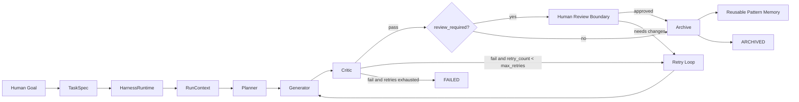
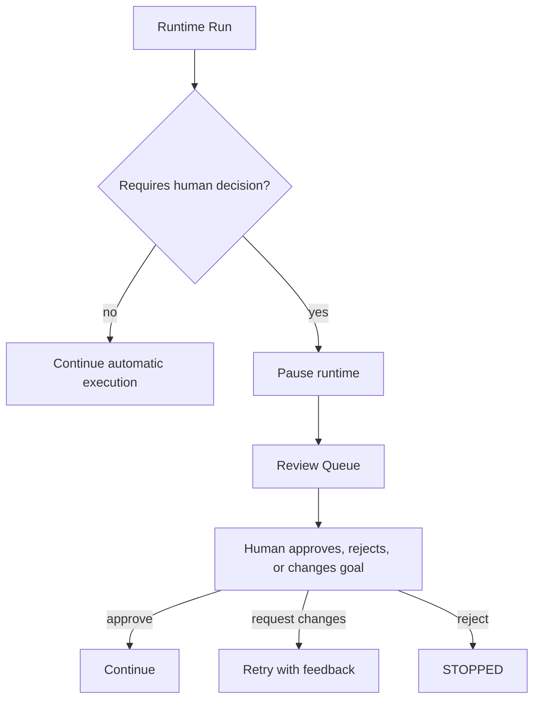
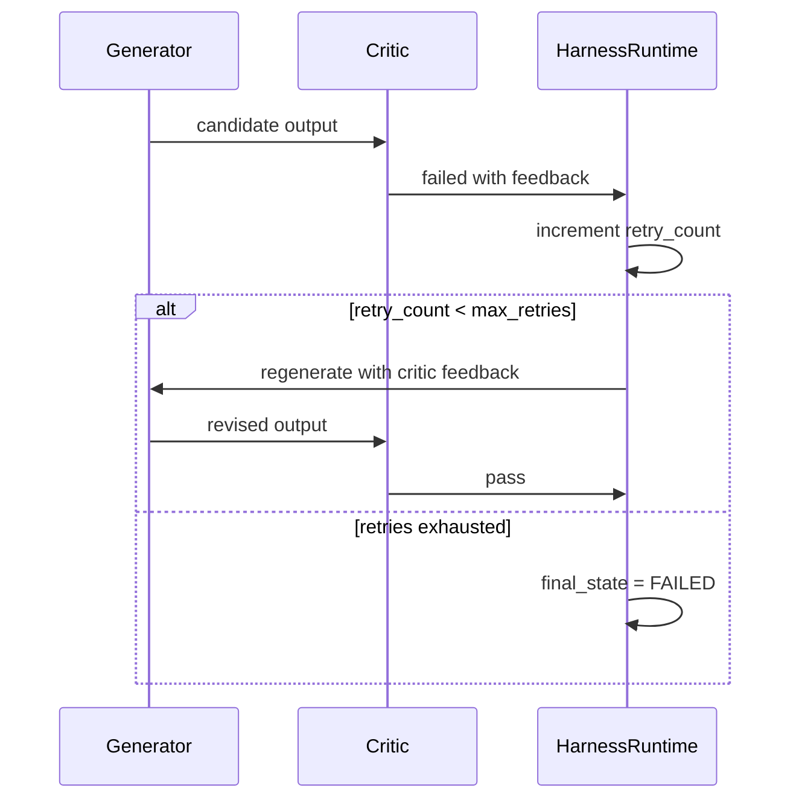
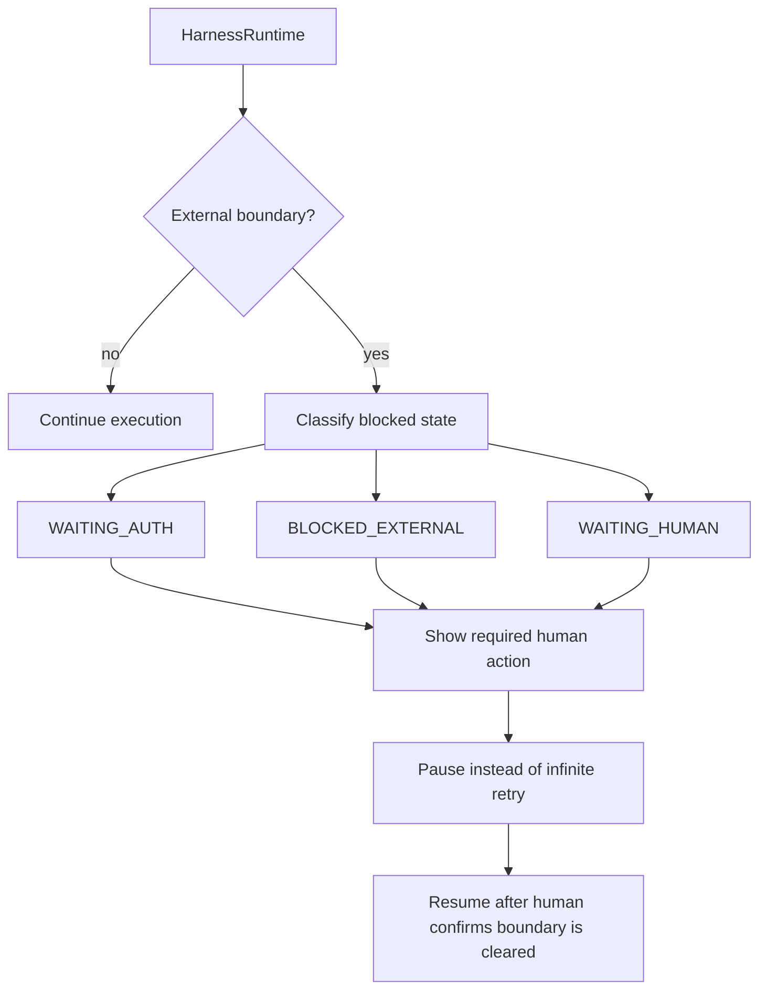
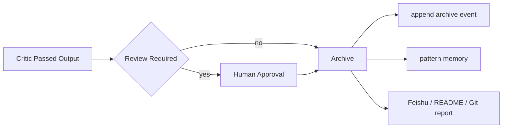
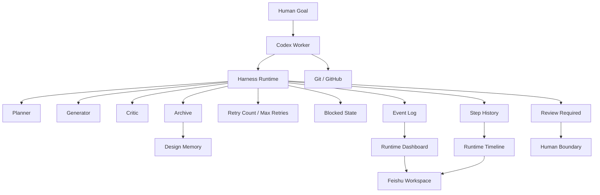

# Runtime Flow

This diagram describes the current AI Native Design Runtime lifecycle: human goal intake, deterministic Harness execution, review boundary, retry loop, blocked state, and archive flow.

## Runtime Lifecycle

## Human Review Boundary

## Retry Loop

## Blocked State

## Archive Flow

## Runtime OS Architecture

