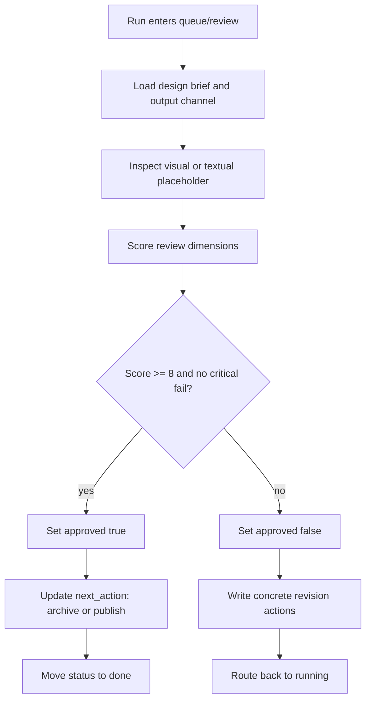

# Design Critic Runtime

This runtime note defines how `design_critic` behaves inside the lightweight Agent Runtime.

## Agent Binding

- Registry key: `design_critic`
- Agent spec: `agents/design_critic/AGENT.md`
- Input queue: `queue/review`
- Pass output: `queue/done`
- Fail output: `queue/running`
- Primary run field: `review_score`

## Purpose

The Design Critic Agent turns subjective design review into a repeatable gate. It checks whether an output can move from visual draft to approved asset, or whether it must return to revision.

## Required Inputs

- `design_image`: image path, screenshot path, or textual placeholder if the image is not available yet.
- `design_brief`: what the design is meant to communicate.
- `brand_rules`: known style, typography, color, tone, or business constraints.
- `output_channel`: poster, Xiaohongshu cover, card set, PPT page, brand manual, or other target.

## Review Dimensions

| Dimension | What to Check | Fail Signal |
|---|---|---|
| Typography | Font size, hierarchy, line height, spacing, Chinese readability | text too small, overlapping, illegible |
| Density | Amount of content, breathing room, visual grouping | page feels crowded or unfocused |
| Brand | Color, tone, motif, message, cultural fit | style drift, generic AI look, brand inconsistency |
| Composition | Focal point, grid, alignment, image-text balance | no clear visual priority |
| Feasibility | Materials, construction, production constraints | cannot be built, printed, installed, or exported realistically |
| Channel Fit | Xiaohongshu hook, cover readability, scroll-stopping value | weak cover, unclear benefit, low shareability |
| Consistency | Match across pages or assets | each page feels like a different project |

## Score Model

Use a 10-point score:

- `9-10`: approved. Only minor polish remains.
- `7-8`: conditionally approved. Needs small edits but no structural redesign.
- `5-6`: revision required. Core direction is usable, but key issues remain.
- `1-4`: reject. Strategy, brand fit, or execution quality is not acceptable.

Default approval threshold:

```yaml
approved: true
review_score: 8
```

If the output is for public publishing, Xiaohongshu cover, client-facing proposal, signage, packaging, or production handoff, use stricter judgment.

## Runtime Flow



## History Entry Pattern

Append a history item each time a review is performed:

```yaml
- at: "2026-05-17T00:00:00+08:00"
  agent: "design_critic"
  from_status: "review"
  to_status: "running"
  action: "reviewed_poster"
  summary: "Rejected because title text was too small, visual density was too high, and brand color drifted from the brief."
  review_score: 5
  approved: false
```

## Output Contract

The Design Critic must write:

- concise verdict
- score
- critical issues
- specific revision actions
- approval decision
- recommended next agent

## Non-Negotiable Fail Conditions

Return to `running` if any of these appear:

- Important Chinese text overlaps or clips.
- Core title is unreadable at phone-screen size.
- Page is too full to scan in 2 seconds.
- Style conflicts with brand context.
- Production requirement is impossible or unsupported.
- Xiaohongshu cover does not communicate a clear reason to tap, save, or share.
