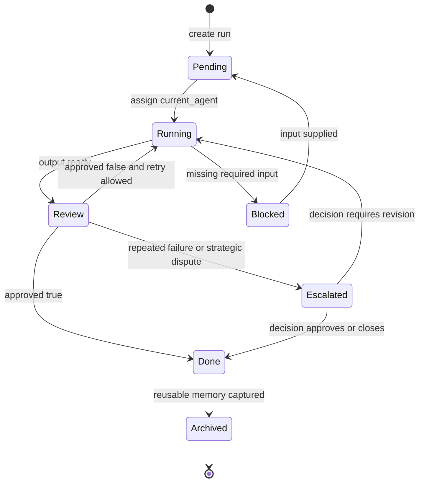

# Agent Runtime Orchestrator Protocol

This document defines the lightweight orchestration layer for the Agent Runtime. It is a running protocol, not executable code. Codex or a human operator can follow it today; later it can become a small script or Harness adapter.

## Purpose

The orchestrator decides:

- which agent should run next
- which queue state a run belongs to
- when output enters review
- when failed review should retry
- when a task should escalate
- when `approved` can be set to `true`

The orchestrator does not create design assets by itself. It routes work between agents and keeps `runs/*.yaml` honest.

## Inputs

- `agents/registry.yaml`
- `runs/*.yaml`
- `queue/pending`
- `queue/running`
- `queue/review`
- `queue/done`
- agent-specific runtime docs under `runtime/`
- agent specs under `agents/`

## Agent Scheduling Rules

1. The orchestrator must read the run record before choosing an agent.
2. `current_agent` must match an agent key in `agents/registry.yaml`.
3. If `current_agent` is empty or invalid, choose the first agent from the default route that can accept the available inputs.
4. Do not skip review for public, client-facing, brand, production, or Xiaohongshu outputs.
5. If an agent cannot proceed because required inputs are missing, set `status: blocked` and write the missing input into `next_action`.
6. If a run has failed review twice for the same reason, escalate to `ceo` or a human decision before another retry.
7. If `approved: true`, route only to archive, publish, brand manual extraction, or done.

## Default Route

```text
design_ingest
  -> prompt_optimizer
  -> xiaohongshu or generator-like production step
  -> design_critic
  -> brand_manual or publisher
  -> done
```

For the current lightweight runtime, there is no separate generator agent in the registry. Visual generation can be represented as a `current_step` under `prompt_optimizer`, `xiaohongshu`, or a future dedicated agent.

## Queue Flow Rules

| Queue | Status | Meaning | Allowed Next Queue |
|---|---|---|---|
| `queue/pending` | `pending` | Run exists and awaits assignment | `queue/running` |
| `queue/running` | `running` | Current agent is producing or revising output | `queue/review`, `queue/pending` when blocked |
| `queue/review` | `review` | Output awaits critique or approval | `queue/done`, `queue/running` |
| `queue/done` | `done`, `archived` | Run is approved, closed, published, or archived | none by default |

Queue folders are markers. The source of truth is the run YAML.

## Review Rules

A run should enter `review` when:

- a visual draft is exported
- a Xiaohongshu card set is ready
- a prompt set is ready for quality check
- a brand manual section is ready for acceptance
- a production-facing asset needs feasibility review

The review agent must update:

- `review_score`
- `approved`
- `outputs`
- `next_action`
- `history`

## Retry Rules

Retry means the run returns from `review` to `running` with a specific correction task.

Retry is allowed when:

- `approved: false`
- `review_score` is below threshold
- critical issues are concrete and fixable
- `next_action` names the required revision

Retry should preserve:

- original brief
- prior outputs
- review comments
- history entries

Do not retry blindly. Every retry must name what changes.

## Escalation Rules

Escalate to `ceo` or a human decision when:

- the same critical issue appears after two retries
- brand direction conflicts with business intent
- production feasibility cannot be determined from available inputs
- approval threshold is disputed
- requested output may be off-brand, misleading, or not worth publishing
- the run needs budget, schedule, venue, legal, or stakeholder judgment

Escalation updates:

```yaml
current_agent: "ceo"
current_step: "Resolve escalated design decision."
status: "running"
next_action: "Decide whether to revise, approve with risk, or close the run."
```

## `next_agent` Selection Logic

Choose `next_agent` by matching the run's current output to the next needed capability:

| Current Need | next_agent |
|---|---|
| Raw materials need structure | `design_ingest` |
| Brief needs prompts or visual directions | `prompt_optimizer` |
| Content should become Xiaohongshu cards | `xiaohongshu` |
| Draft needs quality review | `design_critic` |
| Approved work should become reusable rules | `brand_manual` |
| Approved package should be released or archived | `publisher` |
| Decision is blocked or strategic | `ceo` |

If two agents are plausible, pick the one that reduces uncertainty before production. For example, choose `design_critic` before `publisher`, and choose `ceo` before another retry when business direction is unclear.

## `approved` Decision Logic

Set `approved: true` only when all conditions are met:

1. The current output exists or is explicitly represented by a placeholder in the run.
2. Required review has happened for the output channel.
3. `review_score` meets the threshold for the channel.
4. No non-negotiable fail condition remains.
5. `next_action` points to publish, archive, pattern extraction, or closure.

Default threshold:

```yaml
review_score: 8
approved: true
```

Use stricter judgment for:

- public Xiaohongshu cover images
- client-facing proposals
- brand identity assets
- signage or construction-related outputs
- claims about production feasibility

Set `approved: false` when:

- score is below threshold
- Chinese text is illegible
- layout is too crowded
- brand fit is weak
- production feasibility is unsupported
- Xiaohongshu cover lacks a clear hook

Set `approved: null` when the run has not reached a real review decision.

## State Machine



## Orchestrator Update Pattern

Every orchestrator move appends a history entry:

```yaml
- at: "2026-05-17T00:00:00+08:00"
  agent: "orchestrator"
  from_status: "review"
  to_status: "running"
  action: "route_retry"
  summary: "Design Critic rejected the draft; routing back for typography and density revision."
  review_score: 6
  approved: false
  next_agent: "prompt_optimizer"
```

## Minimal Operating Procedure

1. Open the run YAML.
2. Check `status`, `current_agent`, `approved`, `review_score`, and `next_action`.
3. Check the current agent in `agents/registry.yaml`.
4. Decide whether to assign, continue, review, retry, escalate, or close.
5. Update the run YAML.
6. Append history.
7. Keep queue state conceptually aligned with `status`.

## Current Mock Boundary

This protocol is still manual. It does not move files automatically, run agents in parallel, validate registry references, or execute `harness/runtime.py`. Its value is that the routing decisions are now explicit and can be implemented later without redesigning the workflow.
