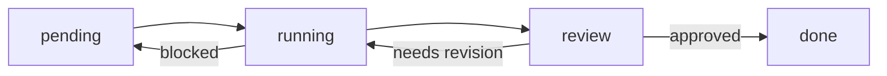

# Lightweight Agent Runtime Run Manager

This document defines the first non-code runtime layer for the design workflow Agent Harness. It is intentionally lightweight: state lives in YAML run records and queue folders, while Codex or another human-operated agent performs the transitions.

## Runtime Goal

The runtime should let a user quickly create, route, review, and archive design-agent tasks without rewriting business code. It is not a replacement for `harness/` yet. It is a document-first operating layer that can later be automated.

## Core Objects

| Object | Path | Purpose |
|---|---|---|
| Agent registry | `agents/registry.yaml` | Declares available agents, their inputs, outputs, and queue handoffs. |
| Run record | `runs/*.yaml` | Stores task state, current agent, outputs, review result, and history. |
| Queue folders | `queue/pending`, `queue/running`, `queue/review`, `queue/done` | Represent coarse task state. |
| Runtime notes | `runtime/*.md` | Explain how a specific agent should execute inside the state model. |

## State Flow

## State Definitions

- `pending`: task exists, but no agent has started execution.
- `running`: current agent is actively producing or revising outputs.
- `review`: output is ready for critique or approval.
- `done`: output is approved, archived, or closed with an explicit reason.
- `blocked`: task cannot proceed until missing input, decision, or asset is supplied.
- `archived`: task has been retained for memory or reference, and no further action is planned.

## Minimal Manual Runtime Loop

1. Create a run record from `runs/run_template.yaml`.
2. Put the task conceptually in `queue/pending`.
3. Set `current_agent` from `agents/registry.yaml`.
4. Move status to `running` and append a `history` entry.
5. Let the agent produce the declared output.
6. Move status to `review` when the output is ready for critique.
7. If approved, set `approved: true`, move status to `done`, and archive useful patterns.
8. If rejected, set `approved: false`, write `next_action`, and route back to `running`.

## Run Record Update Rules

Every meaningful transition must update:

- `current_agent`
- `current_step`
- `status`
- `outputs`
- `review_score` when review happens
- `approved` when an approval decision exists
- `next_action`
- `history`

History entries should be append-only. Do not rewrite earlier state unless correcting a typo immediately after creation.

## Queue Folder Usage

The queue directories are state markers, not storage for heavy assets. Keep source files, images, and exports in project-specific docs or asset folders. Queue entries may later become symlinks or tiny YAML references, but this version only creates the folders and state contract.

## What This Runtime Does Not Do Yet

- It does not schedule agents automatically.
- It does not execute `harness/runtime.py`.
- It does not call Pipeline CLIs.
- It does not validate YAML against a schema.
- It does not move files between queue folders automatically.
- It does not persist vector memory or semantic search.

## What It Enables Now

- A stable registry of design agents.
- A visible state model for design tasks.
- A run record format with audit history.
- A review loop that can graduate from manual Codex execution to scripted automation later.
